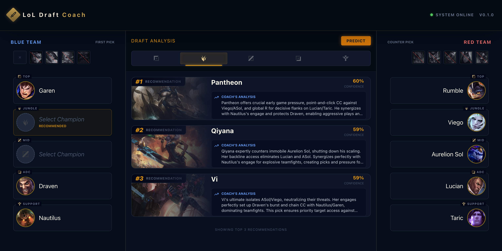
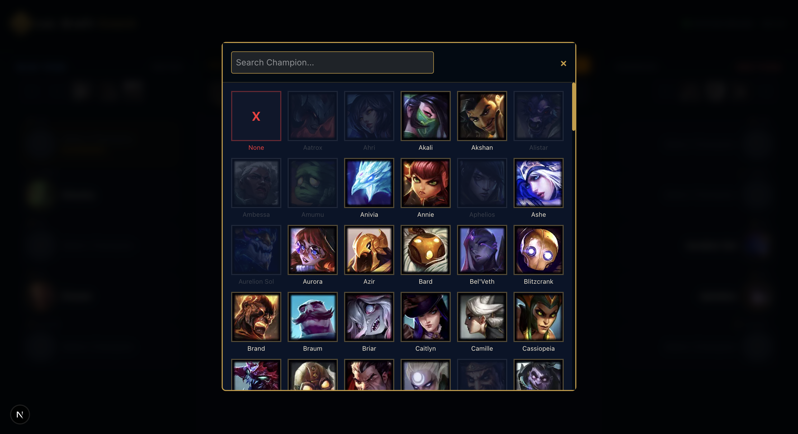

# League of Legends Draft Coach


[](https://github.com/YoussefSamaan/LoL-Coach/actions/workflows/ci.yml)
[](https://github.com/YoussefSamaan/LoL-Coach/actions/workflows/docker.yml)


**LoL Coach** is an interactive **champ select assistant** that recommends champions for a target role based on the current draft state (allies, enemies, bans). It uses an **Additive Lift Model** to provide **explainable** recommendations (synergy/counter signals). 

The system follows a complete ML product lifecycle:
1.  **Ingestion**: Fetching raw match data via Riot API pipelines.
2.  **Aggregation**: Offline processing to build lift statistics and counters.
3.  **Inference**: Real-time scoring API serving the frontend.
4.  **UI**: A polished, responsive interface for the end user.

> **Target audience:** Players who want help drafting champions and learning *why* they should pick a champion.

---

## Screenshots





---
## ⚡️ Try It Out (Local)

Run the full app immediately—**no API keys required**!

### 1) Clone
```bash
git clone https://github.com/YoussefSamaan/LoL-Coach.git
cd LoL-Coach
```

### 2) Run Backend (Terminal 1)
```bash
./run_backend.sh
```

### 3) Run Frontend (Terminal 2)
```bash
./run_frontend.sh
```
**Open [http://localhost:3000](http://localhost:3000)**, select a role, fill draft slots, and click **Recommend**.

> **Note:** Includes pre-built demo artifacts (small sample) so it runs out-of-the-box. For stronger recommendations, ingest more matches and rebuild artifacts.
> *   **No Riot Key needed** (unless you want to ingest fresh data).
> *   **No Gemini Key needed** (you'll get standard explanations instead of AI-generated ones).

---


## ✨ Features

- **Draft Board**: Interactive UI for picking allies, enemies, and bans.
- **Smart Recommendations**: Role-based suggestions (TOP / JUNGLE / MID / ADC / SUPPORT).
- **Explainable Scoring**: Breakdowns for "Synergy Lift" and "Counter Lift".
- **League-themed UI**: Glassmorphism design, micro-animations, and responsive layout.
- **ML Pipeline**: Automated ingestion, offline aggregation (Strategy Pattern), and real-time inference.
- **Exceptional Quality**: **100% Backend** and **100% Frontend** test coverage.

---

## 🏗 Design Patterns & Architecture

### Backend (FastAPI / Python)
*   **Pipeline Pattern**: Data ingestion is orchestrated as a series of distinct steps (Fetch -> Parse -> Aggregate).
*   **Strategy Pattern**: Each pipeline step (`app/ingest/steps/`) encapsulates a specific algorithm, making the pipeline easily extensible.
*   **Repository Pattern**: The `ModelRegistry` (`app/services`) abstracts artifact loading and versioning.
*   **Singleton**: Configuration settings are cached and globally accessible.

### Frontend (Next.js / React)
*   **Custom Hooks**: Complex business logic (Draft state, API calls) is encapsulated in hooks (`useDraft`, `useRecommendations`), separating logic from UI.
*   **Component Composition**: UI is built from small, focused components (`DraftCenter`, `TeamColumn`) assembled into the main page.
*   **Container/Presenter**: Logic-heavy containers pass data to pure presentational components.

---

## 🚀 Workflow

1.  **Ingest**: The backend pipeline fetches match data from Riot, parsed into efficient artifacts.
2.  **Offline artifact build**: Aggregates winrates/synergy/counter lifts and applies smoothing to produce versioned artifacts used by inference.
3.  **Draft UI**: Users select their team and enemy team in the Next.js frontend.
4.  **Recommend**: The API calculates the best picks by combining:
    *   Base Role Winrate
    *   Synergy with Allies
    *   Counters to Enemies
5.  **Explain**: Returns the "Why" (e.g., "+4% winrate with Jinx").

---

## 🔌 API

### Primary Endpoint
`POST /v1/recommend/draft`

**Request:**
```json
{
  "role": "MID",
  "allies": ["Ahri", "Jinx"],
  "enemies": ["Zed"],
  "bans": ["Yasuo"],
  "top_k": 10
}
```

**Response:**
```json
{
  "role": "MID",
  "allies": ["Ahri", "Jinx"],
  "enemies": ["Zed"],
  "bans": ["Yasuo"],
  "recommendations": [
    {
      "champion": "Orianna",
      "score": 0.578,
      "reasons": [
        "Base Winrate: 51.5%",
        "Synergy Lift: +4.2%",
        "Counter Lift: +2.1%",
        "Final Prob: 57.8%"
      ],
      "explanation": "Strong control mage that scales well..."
    }
  ]
}
```

### Utility Endpoints
*   `GET /health` — System status
*   `GET /version` — Artifact/Model version info

---

## 🐳 Docker

A `docker-compose.yml` is included to spin up the full stack.

```bash
docker compose up --build
```
Starts:

* Frontend: http://localhost:3000
* Backend: http://localhost:8000

---

## ⚙️ Configuration

### Root Config
A `config.yml` file at the root manages development settings (ports, test coverage thresholds, linting rules) for both services.

### Environment Variables
*   **Frontend**: `NEXT_PUBLIC_BACKEND_URL` (Defaults to localhost).
*   **Backend**: 
    *   `RIOT_API_KEY`: Required for fetching new data.
    *   `GEMINI_API_KEY`: Required for generating LLM explanations.
    *   `PORT`: Port configuration.

### Data & Patch
*   **DataDragon**: Champion metadata + images are loaded from Riot DataDragon for a configured patch version (currently 14.24.1).
*   **GenAI**: Hooks (`app/genai`) are available for LLM integration (Google Gemini), though optional for the MVP.

---

## 🧪 Development Workflow

### Backend
```bash
./run_backend.sh test   # Run full test suite (Pytest)
./run_backend.sh fix    # Auto-fix linting (Ruff)
./run_backend.sh run    # Start server
```

### Frontend
```bash
./run_frontend.sh test  # Run tests (Vitest)
./run_frontend.sh fix   # Fix linting
./run_frontend.sh run   # Start dev server
```

---

## 📂 Repo Structure

```txt
LoL Coach/
├── backend/            # FastAPI, ML Models (Additive Lift), Ingestion
│   ├── app/
│   │   ├── api/            # FastAPI Routers (v1)
│   │   ├── config/         # App Configuration
│   │   ├── domain/         # Business Logic & Enums
│   │   ├── genai/          # LLM Integration (Gemini)
│   │   ├── ingest/         # Ingestion Pipeline (Strategy Pattern)
│   │   ├── ml/             # Additive Lift Model & Artifacts
│   │   ├── riot_accessor/  # Resilient Riot API Client
│   │   ├── schemas/        # Pydantic Models
│   │   ├── services/       # Service Layer (ModelRegistry)
│   │   └── utils/          # Logging & Helpers
│   └── tests/              # 100% Coverage Suite
├── frontend/
│   ├── app/                # Next.js App Router
│   ├── components/         #
│   │   ├── draft/          # Draft Board Components
│   │   └── ui/             # Shared UI Components
│   ├── hooks/              # Custom React Hooks
│   ├── constants/          # App Constants
│   ├── types/              # TypeScript Definitions
│   └── tests/              # 100% Coverage Suite
├── context/                # Specifications, Reviews, & Status Boards
├── run_backend.sh          # Backend Setup/Test/Run Script
├── run_frontend.sh         # Frontend Setup/Test/Run Script
└── config.yml              # Central Dev Config
```

---

## Disclaimer
LoL Coach is a personal project and is **not affiliated with Riot Games**. Data sources include Riot APIs and DataDragon; make sure usage complies with Riot’s developer policies.
